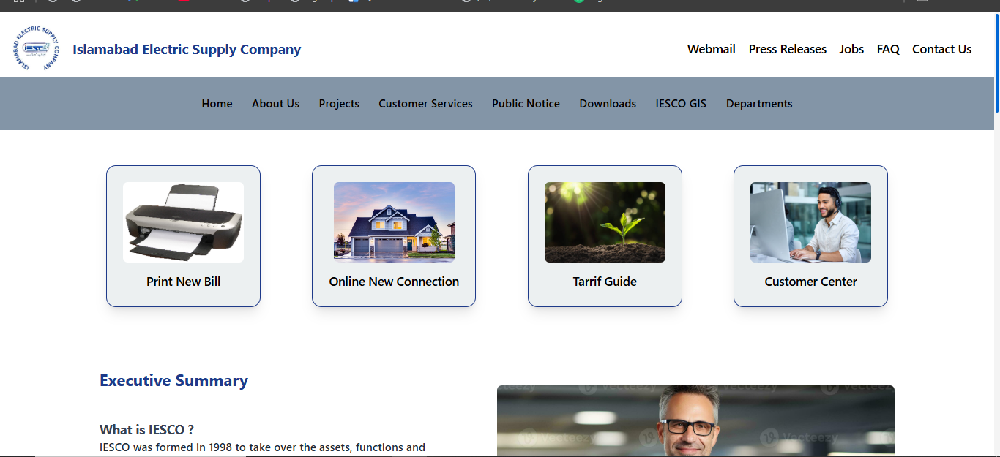

 
Here’s a detailed summary you can add to your GitHub repository for the ISCEO company website project:

ISCEO Company Website :
Overview :
This project is a personal practice project where I developed a responsive website for a fictional company called ISCEO. The website is designed to showcase a basic company layout and functionality, serving as the first version of this project.

Features :
Home Page:

A clean and professional design to introduce the company.
Responsive layout that works seamlessly on all screen sizes (mobile, tablet, and desktop).
About Us Page:

Contains information about the company and its goals.
Maintains the same responsive design principles.
Technologies Used :
HTML5: For structuring the content.
CSS3 (Tailwind CSS): For styling and responsiveness.
JavaScript/React.js: (Include a dynamic functionality ).
Notes :
This is the first version of the project and will be further improved in future iterations.
The main focus was on creating a fully responsive design and practicing layout techniques.
Future Enhancements
Add more pages (e.g., Contact Us, Services).
Improve the design and interactivity.
Add animations or advanced UI components.
<video controls src="loom-video (2).mp4" title="Title"></video>
#FSZ  #html #Css #Tailwind #Javascript #React 